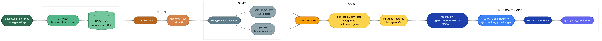
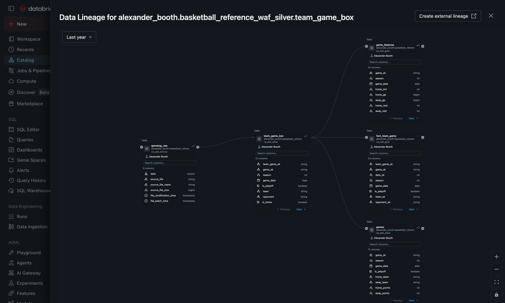
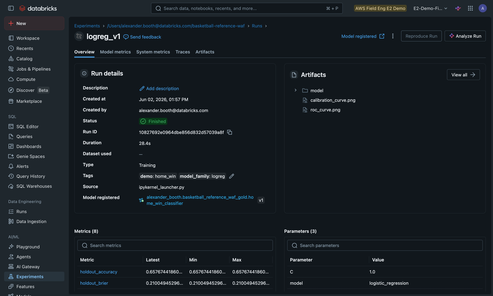
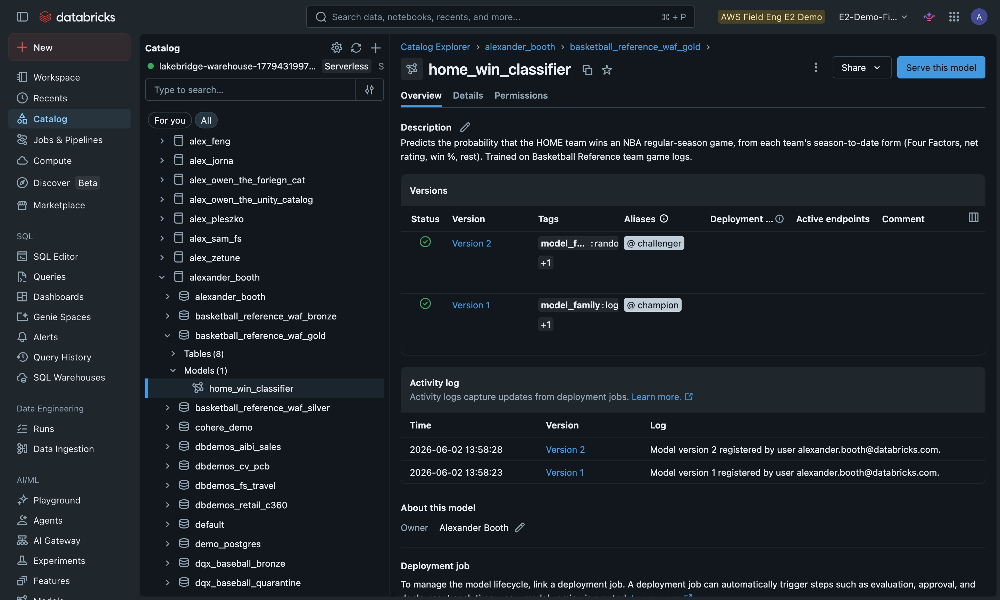
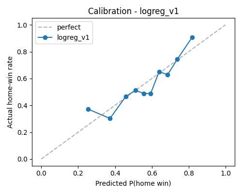

# From Box Scores to a Calibrated Win Model: An End-to-End NBA Pipeline on Databricks

*Ingest, govern, model, and serve NBA data on Databricks — a bronze → silver → gold medallion, leakage-safe features, and an MLflow model that produces a trustworthy home-win probability.*

Everybody can train a model that guesses who wins a basketball game. The hard part isn't the model — it's everything around it: getting the data in cleanly, governing it, engineering features that don't secretly peek at the future, and producing probabilities you can actually trust. This post walks through a small, complete demo that does all of that on Databricks, end to end, in nine notebooks.

The result is the basketball cousin of an expected-goals model: instead of "who wins," it answers *"what's the probability the home team wins — and how confident should we be?"*



## The data: team game logs from Basketball Reference

The source is public box-score data from [Basketball Reference](https://www.basketball-reference.com/). The first design decision was *how* to pull it, and it matters more than you'd think.

Basketball Reference rate-limits to about **20 requests per minute** and will IP-block you for roughly an hour if you cross it. A naive per-day box-score scrape needs ~170 requests *per season*. Instead, we scrape one **team season game-log page** per team — and each page already contains every game's full box score for that team *and* its opponent. That turns the whole job into ~30 teams × 3 seasons ≈ **90 polite requests**, throttled and cached to a Unity Catalog Volume so re-runs are instant.

> A note on data: Basketball Reference's terms restrict scraping and redistribution. This is an internal demo on public, aggregate stats — for a real project, point the ingest step at your own data or a licensed feed. Everything downstream is identical.

The parser is deliberately forgiving — it grabs *every* cell keyed by Basketball Reference's `data-stat` attribute and lands it untouched:

```python
def parse_gamelog(html, abbr, year):
    html = html.replace("<!--", "").replace("-->", "")  # un-hide commented tables
    doc = lxml.html.fromstring(html)
    rows = []
    for table_id, is_playoff in (("team_game_log_reg", False),
                                 ("team_game_log_post", True)):
        table = doc.get_element_by_id(table_id)
        for tr in table.xpath(".//tbody/tr"):
            cells = {c.get("data-stat"): c.text_content().strip()
                     for c in tr.xpath("./th|./td") if c.get("data-stat")}
            if cells.get("date"):
                rows.append({**cells, "team": abbr,
                             "season_end_year": year, "is_playoff": is_playoff})
    return rows
```

## Bronze: land it raw as VARIANT

The bronze layer doesn't try to be clever. Auto Loader reads each landed file and stores the raw JSON as a single `VARIANT` column — **schema-on-read**:

```python
(spark.readStream.format("cloudFiles")
     .option("cloudFiles.format", "text").option("wholetext", "true")
     .option("cloudFiles.schemaLocation", SCHEMA_LOC)
     .load(SOURCE_PATH)
     .selectExpr("PARSE_JSON(value)   AS data",
                 "_metadata.file_path AS source_file",
                 "current_timestamp() AS file_batch_time")
     .writeStream.option("checkpointLocation", CHECKPOINT)
     .trigger(availableNow=True).toTable(BRONZE_TABLE))
```

This paid off immediately. Midway through building the demo, Basketball Reference changed their page markup — tables and fields were renamed. Because bronze keeps the raw payload, the fix was a one-line change in *one* downstream query; nothing had to be re-scraped.

## Silver: typed tables and the Four Factors

Silver is where it becomes basketball. We explode the raw rows into one record per team per game, type everything, and compute Dean Oliver's **Four Factors** — the box-score metrics most correlated with winning: shooting (eFG%), turnovers, rebounding, and free throws. A team's *defensive* Four Factors are just its opponent's offensive numbers, which are on the same row:

```sql
(fgm + 0.5 * fg3m) / NULLIF(fga, 0)            AS efg,       -- shooting
tov / NULLIF(fga + 0.44 * fta + tov, 0)        AS tov_pct,   -- turnovers
orb / NULLIF(orb + opp_drb, 0)                 AS orb_pct,   -- rebounding
ftm / NULLIF(fga, 0)                           AS ft_rate    -- free throws
```

We also add MD5 surrogate keys (both teams in a game share one `game_sk`, so they join cleanly), `RELY` primary/foreign keys, and `CHECK` constraints as enforced data-quality guards. A second table, `games`, collapses this to one row per game with the `home_win` label.

## Gold: a star schema and leakage-safe features

Gold shapes silver into a small star schema (`dim_team`, `dim_date`, `fact_games`, `fact_team_game`) — the `RELY` keys even render an ERD in Catalog Explorer. And because every layer is plain Spark SQL, Unity Catalog tracks the lineage automatically — raw gamelogs through silver into the gold tables, with no extra work:


*Column-level lineage in Unity Catalog: `gamelog_raw` (bronze) → `team_game_box` (silver) → `games`, `fact_team_game`, and `game_features` (gold).*

The feature table is where most sports models quietly cheat. To predict a game *before* it happens, every feature must use only games that finished *before* tip-off. We enforce that with a window frame that ends one row early:

```sql
AVG(net_rtg) OVER (
    PARTITION BY team, season
    ORDER BY game_date, game_sk
    ROWS BETWEEN UNBOUNDED PRECEDING AND 1 PRECEDING   -- strictly prior games
) AS net_rtg_avg
```

That `1 PRECEDING` guarantees a game's own result can never leak into its features. We compute each team's season-to-date win %, average margin, net rating, all eight Four Factors, and rest days, then attach the home and away versions to each game as difference features. A guard query confirms zero leakage.

## The model: three candidates, MLflow, and Unity Catalog

We train three classifiers that each output a probability the home team wins — Logistic Regression, Random Forest, and XGBoost — and log everything to MLflow: parameters, metrics, an ROC curve, and (the one we care about most) a **calibration** curve.

```python
with mlflow.start_run(run_name=run_name):
    estimator.fit(X_train, y_train)
    mlflow.log_metrics({"val_log_loss": ll, "val_roc_auc": auc,
                        "val_accuracy": acc})
    mlflow.log_figure(calibration_fig, "calibration_curve.png")
    mlflow.pyfunc.log_model("model", python_model=HomeWinModel(estimator),
                            signature=sig, input_example=X_train.head(3))
```


*Every run is tracked in MLflow — parameters, metrics (validation and hold-out), and the logged ROC/calibration artifacts — and links straight to its registered model version.*

The most recent season is held out entirely. We score all three models on that unseen season, pick the **champion** by hold-out log-loss, and register it to Unity Catalog with `@champion` and `@challenger` aliases:

```python
champ = mlflow.register_model(f"runs:/{champion_run_id}/model", FULL_MODEL)
client.set_registered_model_alias(FULL_MODEL, "champion", champ.version)
```


*The model is governed like any other UC asset: versions, `@champion`/`@challenger` aliases, owner, tags, and an activity log — so promoting or rolling back is one alias change.*

## Results

On the held-out 2024-25 season (1,075 games it never saw in training), the champion — Logistic Regression — beat the home-court baseline comfortably:

| Metric | Champion | Home-court baseline |
|--------|----------|---------------------|
| Accuracy | **0.658** | 0.542 |
| Log-loss | 0.606 | — |
| ROC-AUC | 0.725 | — |

That's **+11.5 points** over just always picking the home team — and squarely in the credible range for pre-game NBA prediction (sportsbooks land around 68–70%). But accuracy isn't the headline. The headline is **calibration**: when the model says 75%, the home team wins about 72% of the time; when it says 92%, they win 93%.



A well-calibrated probability is what makes the output *usable* — it's the difference between "this model ranks games" and "this number means something." The upsets it called confidently were real blowouts (Oklahoma City winning 136–95 on the road, for one).

## Batch inference and "bring your own data"

The final notebook loads the model by its alias — not a pinned version — and scores the season back into a governed gold table:

```python
model = mlflow.pyfunc.load_model(f"models:/{FULL_MODEL}@champion")
preds["pred_home_win_prob"] = model.predict(features[FEATURE_COLS].astype(float))
```

Because it loads `@champion`, promoting a new model in the evaluation notebook means inference picks it up automatically — no code change. And because only the ingest notebook is source-specific, swapping Basketball Reference for your own feed (NBA Stats API, a vendor feed, your warehouse) leaves the entire medallion, model, and governance story untouched.

That's the real point of the demo: the basketball model is simple on purpose, but the pipeline around it — governed, leakage-safe, calibrated, and registered in Unity Catalog — is exactly what you'd run in production.

---

*The full demo (nine notebooks, all runnable) lives in the `basketball-reference-waf` directory. The NBA data here is public box-score data used for demonstration only.*
