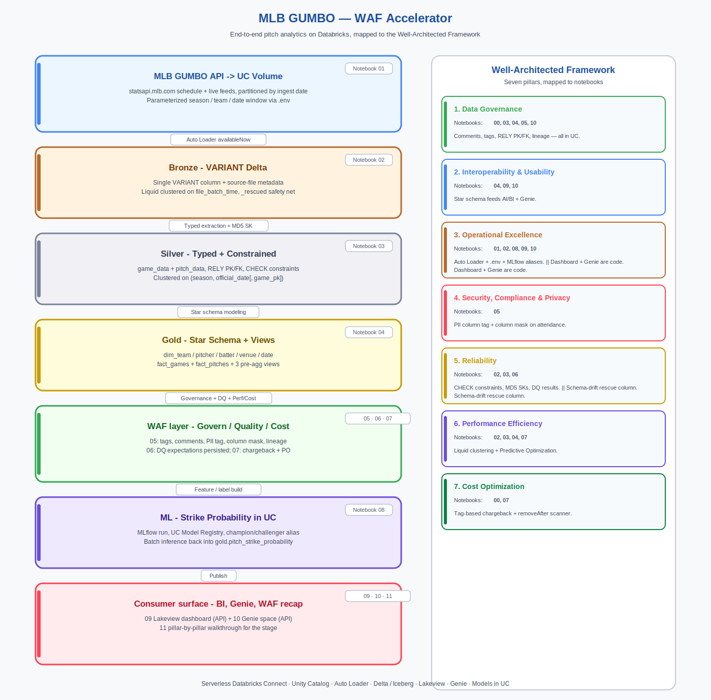

# MLB GUMBO — Well-Architected Framework Accelerator

An end-to-end Databricks demo built around the public MLB **GUMBO** feed
(`statsapi.mlb.com`), structured to walk through **every pillar of the
Databricks Well-Architected Framework (WAF)** against a dataset a baseball
team actually cares about: pitch-by-pitch play data.

This is the *"what does Well-Architected on Databricks look like in practice"*
demo. Every notebook is a pillar story you can tell on stage, built on
**Serverless Databricks Connect** so the same code runs from a SA laptop, a
job, or an IDE without change.

## TL;DR

- **12 notebooks**, run top-to-bottom, each one anchored to one or more WAF pillars
- **2,477 games / 724,180 pitches** of real 2025 MLB data from ingest to gold
- **Full demo in ~7 minutes** from a reset to a published dashboard + Genie space (after the first API ingest — see the [Reset + re-demo](#reset--re-demo) section)
- **Unit tests** for both pure-Python and PySpark transforms
- **All outputs cached in the `.ipynb` files**, so someone reviewing the repo sees exactly what ran

---

## The seven WAF pillars → where they live in this demo

| # | Pillar | Where |
|---|--------|------|
| 1 | **Data Governance** | Bronze/Silver/Gold schemas + comments (`00`), tags + column comments + lineage (`05`), RELY PK/FK (`03`, `04`) |
| 2 | **Interoperability & Usability** | Star schema + pre-agg views (`04`), Lakeview dashboard (`09`), Genie space (`10`) |
| 3 | **Operational Excellence** | `.env`-driven parameterized ingest (`01`), Auto Loader `availableNow` (`02`), MLflow runs + UC model aliases (`08`), dashboard/Genie as code (`09`, `10`), unit tests |
| 4 | **Security, Compliance & Privacy** | PII column tags + column mask on `attendance` (`05`) |
| 5 | **Reliability** | `_rescued` schema-drift safety net (`02`), MD5 surrogate keys (`03`), RELY PK/FK + `CHECK` constraints (`03`, `04`), DQ results table (`06`) |
| 6 | **Performance Efficiency** | Liquid clustering tuned to predicate shape (`02`, `03`, `04`), Predictive Optimization (`07`), Serverless everywhere |
| 7 | **Cost Optimization** | Catalog/schema `cost_center` + `env` + `removeAfter` tags (`00`), `system.billing.usage` chargeback query (`07`), stale-asset scanner (`07`) |

Notebook `11_waf_walkthrough` is the pillar-by-pillar recap — use it as the
closing slide or the handoff document after the session.

---

## What you end the session with

- A **catalog-wide tagging scheme** (`cost_center`, `env`, `data_owner`, `removeAfter`) that flows into `system.billing.usage`.
- A **medallion pipeline** (bronze VARIANT → silver typed → gold star) built on Serverless Databricks Connect.
- A **`fact_pitches`** table with ~724K rows of real 2025 pitch-level data (or less if you scope to one team).
- A **registered Unity Catalog ML model** with champion/challenger alias + per-pitch batch predictions landed back in gold.
- A **published Lakeview dashboard** and **Genie space** wired to the gold layer.
- A **data-quality results table** you can graph to SLA on pipeline freshness + integrity.
- A **governance story** (tags, comments, column mask, lineage) you can drop into any customer conversation.
- A **unit test suite** (pure Python + Spark transforms) that pins analytics helpers against CI.

---

## Architecture



```
           ┌───────────────────────────────────────────────────────────┐
           │  01_ingest_mlb_gumbo                                      │
           │  statsapi.mlb.com → UC Volume raw_gumbo/year=/month=/day= │
           └───────────────────────┬───────────────────────────────────┘
                                   │
                                   ▼
           ┌───────────────────────────────────────────────────────────┐
           │  02_bronze_autoloader                                     │
           │  Auto Loader (availableNow) → VARIANT Delta + checkpoint  │
           │  Liquid clustered on file_batch_time                      │
           └───────────────────────┬───────────────────────────────────┘
                                   │
                                   ▼
           ┌───────────────────────────────────────────────────────────┐
           │  03_silver_game_pitch                                     │
           │  game_data + pitch_data with MD5 SKs, RELY PK/FK, CHECK   │
           └───────────────────────┬───────────────────────────────────┘
                                   │
                                   ▼
           ┌───────────────────────────────────────────────────────────┐
           │  04_gold_star_schema                                      │
           │  dim_team / pitcher / batter / venue / date               │
           │  fact_games + fact_pitches + 3 pre-agg views              │
           └─────────┬─────────────────────────────────────┬───────────┘
                     │                                     │
                     ▼                                     ▼
  ┌──────────────────────────────────┐    ┌─────────────────────────────────┐
  │  05 governance  06 DQ            │    │  08 ML strike probability       │
  │  07 perf + cost                  │    │  UC Models + champion alias     │
  └──────────────────────────────────┘    └─────────────────┬───────────────┘
                     │                                      │
                     └──────────────────┬───────────────────┘
                                        ▼
           ┌───────────────────────────────────────────────────────────┐
           │  09 Lakeview dashboard   +   10 Genie space               │
           │                 11 WAF walkthrough                        │
           └───────────────────────────────────────────────────────────┘
```

---

## Prerequisites

| Requirement | Details |
|-------------|---------|
| **Databricks workspace** | Unity Catalog enabled, Serverless compute available |
| **SQL Warehouse** | Pro or Serverless (for dashboard + Genie — grab the ID from the warehouse's Connection details) |
| **Python** | 3.10 or higher (3.12 tested) |
| **Databricks Connect** | DBR version of `databricks-connect` in `requirements.txt` must match the workspace runtime |
| **Privileges** | `CREATE CATALOG` ideal but not required — you can point `UC_CATALOG` at an existing catalog you own |

---

## Setup

### 1. Clone and create environment

```bash
cd mlb-gumbo-waf
python -m venv .venv
source .venv/bin/activate        # Windows: .venv\Scripts\activate
pip install -r requirements.txt
```

### 2. Configure

```bash
cp .env.example .env
# Edit .env — see "Configuration" below
```

### 3. Run

```bash
jupyter lab
```

Run the notebooks in order, `00 → 11`. First-time ingest of the full 2025
season takes ~30 minutes (API-bound); every subsequent rebuild from the
cached Volume is ~7 minutes total.

---

## Configuration (`.env`)

| Variable | Required | Notes |
|----------|----------|-------|
| `DATABRICKS_HOST` | Yes | Workspace URL |
| `DATABRICKS_TOKEN` | Yes | PAT or OAuth |
| `DATABRICKS_CLUSTER_ID` | No | **Leave blank** for Serverless (recommended) |
| `UC_CATALOG` | Yes | Catalog where demo schemas live |
| `UC_SCHEMA` | Yes | Base schema name → creates `{schema}_bronze`, `{schema}_silver`, `{schema}_gold` |
| `MLB_SEASON` | Yes | e.g. `2025` |
| `MLB_TEAM_ID` | No | Restrict to a single team — recommended if you need a fast one-shot demo |
| `MLB_START_DATE`, `MLB_END_DATE` | No | Override the date window. Defaults cover the full regular season |
| `SQL_WAREHOUSE_ID` | Yes (09, 10) | Used by Lakeview + Genie API calls |
| `WAF_COST_CENTER`, `WAF_ENV`, `WAF_DATA_OWNER`, `WAF_REMOVE_AFTER` | No | Values for the catalog/schema tags — they flow into `system.billing.usage.custom_tags` |

---

## How to demo this

This section is the *running order* — what to click, what to say, and where
to land each pillar. Every demo moment below cites the notebook cell(s) that
back it up, so you can invite the audience to verify live instead of trusting
marketing bullets.

### Before you stand up

1. **Pre-run the ingest.** The MLB API is the only slow part — run notebook `01` ahead of time so the 2,477 JSON files are already in the Volume. The rest of the demo rebuilds from there in ~7 minutes.
2. **Pin three tabs in the browser:**
   - Catalog Explorer → your `{UC_CATALOG}.{UC_SCHEMA}_gold` schema
   - The Lakeview dashboard (URL printed by notebook 09)
   - The Genie space (URL printed by notebook 10)
3. **Have `system.billing.usage` access** in the workspace — it's the CFO slide in notebook 07.
4. **Know which pillars the audience cares about.** See [Audience adapter](#audience-adapter) below.

### The 30-minute default walkthrough

Total: ~25–30 min talking, ~5 min buffer. Numbers in parentheses are measured
cell-execution times from a post-reset rebuild — so you know what to narrate
over.

1. **Frame (2 min).** Open notebook `00`. Read the "Why this matters" table
   at the top — that format is the spine of every notebook. "Every notebook
   we open today has one of these tables. It names the pillar and it names
   *why that choice is a good one*. This demo is not 'a data pipeline';
   it's a Well-Architected Framework checklist against real MLB data."

2. **Pillar 1 — Governance + Pillar 7 — Cost (2 min).** Stay in `00`.
   - Show the `ALTER CATALOG … SET TAGS` cell. "Day-zero tags — `cost_center`,
     `env`, `removeAfter`. They propagate to every schema, table, and
     DBU charge in `system.billing.usage.custom_tags`. This is what
     chargeback-as-code looks like."
   - Show the schema `COMMENT ON`s. "Short, specific comments land on the
     first thing Catalog Explorer and Genie see. Worth real percentage
     points of AI answer accuracy."

3. **Pillar 3 — Operational Excellence (2 min).** Open notebook `01`.
   - Show the parameterized `.env`-driven date window. "This notebook runs
     identically as a demo, a scheduled daily backfill, or a team-scoped
     one-off. No ifs, no forks."
   - Point out the `if os.path.exists(target): skip` line. "Idempotent on
     re-run — scheduled every 15 min, it only downloads new finished games."

4. **Pillar 5 — Reliability + Pillar 6 — Performance (4 min).** Notebook `02`.
   - "`wholetext + PARSE_JSON` gives us a clean VARIANT of the raw payload.
     VARIANT means we never reprocess from the API — the raw evidence stays
     in bronze forever."
   - `rescuedDataColumn = "_rescued"` — "schema-drift safety net; if MLB adds
     a field, it lands in rescue, not the floor."
   - `CLUSTER BY (file_batch_time)` — "liquid clustering tuned to how silver
     reads: 'give me rows since my last load.' No OPTIMIZE ZORDER ceremony,
     no partition predicates to remember."

5. **Pillar 5 — Reliability (deep dive, 3 min).** Notebook `03`.
   - Show the three kinds of constraints at the bottom: RELY PK, RELY FK, CHECK.
     "PKs and FKs feed the Catalog Explorer ERD and the optimizer — zero
     runtime cost. CHECKs are *real enforcement*: a pitch faster than 120 mph
     cannot land here."
   - Show the MD5 surrogate key and `INSERT OVERWRITE`. "Full refresh, no
     state, deterministic. Restart safe."

6. **Pillar 2 — Usability + Pillar 6 — Performance (3 min).** Notebook `04`.
   - Star schema: `dim_*` + `fact_*` + 3 views. "AI/BI and Genie both
     auto-detect this shape. The PKs/FKs make the join graph inferable.
     Gold is the **product**; everything downstream is a consumer."
   - `CLUSTER BY (season, official_date, pitcher_sk)` on `fact_pitches`:
     "tuned to the exact predicates the dashboard and pitcher-leaderboard
     emit. Same table, dramatically less data scanned."

7. **Pillar 1 — Governance (live in Catalog Explorer, 3 min).** Notebook `05`.
   - Run the cell, then switch to Catalog Explorer. **Open the gold schema's
     ERD tab.** "This diagram came *free* from the constraints we just ran —
     no tool to buy." Zoom in so the audience can read it.
   - Click a gold table → show the comments and tags that appeared.
   - **Pillar 4 — Security:** show the `attendance` column mask. "As a
     non-owner user, that value is literally `NULL`. Governance as
     enforcement, not paperwork."

8. **Pillar 5 — Reliability (reprise) (2 min).** Notebook `06`.
   - Show the final `dq_results` table summary. "This is the thing you
     actually tile on a dashboard — pass rate over time, hard failures by
     severity. Bad *data* (CHECK in 03) and bad *pipeline* (DQ here) are
     two different layers of defence."

9. **Pillars 6 + 7 — Performance + Cost (3 min).** Notebook `07`.
   - `ENABLE PREDICTIVE OPTIMIZATION` — "no more OPTIMIZE/VACUUM jobs. We
     stop paying for maintenance that was being done anyway."
   - **The chargeback query** against `system.billing.usage`. "Because we
     tagged the catalog on day zero, every single DBU charge from this demo
     shows up under `cost_center = 'field_engineering'`. This is the CFO
     slide."
   - The `removeAfter` stale-asset scanner. "5 lines of SQL, plug it into
     Lakeflow, never again have an abandoned demo catalog."

10. **Pillars 3 + 1 — MLOps (3 min).** Notebook `08`.
    - AUC + Brier, then the model URI. Open Catalog Explorer on the new
      model at `{UC_CATALOG}.{GOLD_SCHEMA}.strike_probability`. "Model
      lives in Unity Catalog. `GRANT EXECUTE`, tags, lineage, audit —
      same surface as a table."
    - Champion / challenger alias. "Production scoring references
      `models:/...@champion`. Promotion is a metadata flip, not a code deploy.
      This run registered v2 as challenger; v1 is still champion. One line
      promotes it when we're ready."
    - The `pitch_strike_probability` table. "724K predictions landed back
      into gold, same governance as every other table here."

11. **Pillar 2 — Usability (live in UI, 4 min).** Switch to the dashboard tab.
    - Walk through 3 panels. "Every one of these hits `fact_pitches` or a
      pre-agg view. Lakeview infers the joins from the FKs we wired up in 04."
    - Switch to the Genie tab. Ask **"which pitchers throw the hardest
      fastballs"** — Genie generates correct SQL using the pitch-type codes
      you defined in the space's instructions.
    - **The money shot:** ask **"show me the top 5 games by attendance."**
      If the viewer isn't in `mlb_analytics_team`, attendance comes back
      NULL. "Column mask from notebook 05 is enforced at the data layer —
      Genie has no bypass. Same for Lakeview, same for any BI tool."

12. **The WAF recap (2 min).** Open `11_waf_walkthrough`. Scroll. "Every
    pillar we've touched is in this notebook with a link back to the exact
    cell that proved it. This is your handoff document."

### The 15-minute lightning version

Skip to: `00` tags → `04` star schema → `07` chargeback query →
Catalog Explorer ERD → `08` champion alias → Genie (with the attendance
column-mask demo) → `11` walkthrough.

### The 60-minute deep dive

Run the 30-min default, plus:
- **Live-edit** a silver column comment in `03` and refresh Catalog Explorer
  to show it flow through.
- **Run `pytest tests/ -v`** live. "This is the same kind of CI gate we'd
  put on a customer pipeline — pure-Python tests run in milliseconds, the
  Spark transform tests run against serverless."
- **Promote the challenger** in `08` (`client.set_registered_model_alias(MODEL_NAME, "champion", "2")`)
  and re-run the batch inference cell. "Zero-downtime promotion. That's
  the WAF pattern."
- **Show `system.access.audit`** for a PII-tagged column. "Any query that
  touched a contains_pii column is a single join away."

---

## Audience adapter

Match the walkthrough to the room:

| Audience | Start here | Lean into | Skip / de-emphasize |
|----------|------------|-----------|---------------------|
| **CDO / Data Governance lead** | `00` tags → `05` governance → Catalog Explorer ERD | Domains, Discover, column mask, lineage graph | Predictive optimization internals |
| **CFO / FinOps** | `07` chargeback query first | Tag propagation, `removeAfter` scanner, serverless-vs-cluster | ML + Genie if time is tight |
| **Data Engineering Lead** | `02` Auto Loader → `03` CHECK constraints | `_rescued` column, liquid clustering, DQ results table, unit tests | Column masks, Genie |
| **ML Lead** | `08` MLflow → `@champion` alias | UC model governance, batch inference, signature enforcement | Dashboard creation |
| **Exec / Mixed** | `11_waf_walkthrough` first (set the frame) | Picks of 3: `00` tags, Catalog ERD, Genie attendance demo | Everything else is on-demand |

---

## Notebook reference

| # | Notebook | WAF pillars | Typical run time |
|---|----------|-------------|------------------|
| 00 | `00_verify_connection` | Governance, Cost Optimization | ~5 s |
| 01 | `01_ingest_mlb_gumbo` | Operational Excellence, Reliability | ~30 min (full season); ~1 min (one team); 0 s if Volume already populated |
| 02 | `02_bronze_autoloader` | Reliability, Performance Efficiency, Governance | ~60 s |
| 03 | `03_silver_game_pitch` | Reliability, Governance, Performance | ~40 s |
| 04 | `04_gold_star_schema` | Performance Efficiency, Usability | ~70 s |
| 05 | `05_governance_tags_lineage` | Governance, Security, Reliability | ~40 s |
| 06 | `06_reliability_dq` | Reliability, Operational Excellence | ~30 s |
| 07 | `07_performance_cost` | Performance Efficiency, Cost Optimization | ~20 s |
| 08 | `08_ml_strike_probability` | Operational Excellence, Governance, Reliability | ~2 min |
| 09 | `09_create_dashboard` | Usability, Operational Excellence | ~5 s |
| 10 | `10_create_genie_space` | Usability, Governance | ~5 s |
| 11 | `11_waf_walkthrough` | All seven | ~10 s (markdown + 2 summary queries) |

Run in order — later notebooks depend on tables created earlier.

---

## Reset + re-demo

The demo is designed to be *re-runnable without hitting the MLB API again*.
Notebook `00` has two reset cells:

1. **Preserve the Volume** (default): drops every Delta table and wipes the
   Auto Loader checkpoint, but keeps all raw JSON in
   `/Volumes/{cat}/{schema}_bronze/raw_gumbo/…`. This is what you want
   between demo runs.
2. **Nuclear reset**: `DROP SCHEMA … CASCADE` — also removes the Volume. Only
   use this when you're done with the whole engagement.

**Measured timings** (full 2025 season, ~2,477 games / ~724K pitches):

| Step | Time |
|------|-----:|
| Option 1 reset (drop tables, clear checkpoint) | **26 s** |
| Rebuild 02 → 11 from the preserved Volume | **6 min 46 s** |
| First-ever ingest of the full season (notebook 01) | **33 min** — one-time, API-bound |

So the in-session re-demo loop is **~7 minutes** end to end. A team-scoped
run (`MLB_TEAM_ID` set) is about 5x faster at every stage.

---

## Unit tests

The demo ships with a small test suite (`tests/`, targeting `pitch_helpers.py`):

- **30 pure-Python tests** for `classify_pitch_family`, `strike_pct`,
  `is_plausible_pitch_speed`, `normalize_side` — run in milliseconds.
- **4 Spark transform tests** for `add_pitch_family` (asserts the Spark
  `CASE` and Python classifier agree on every row), `filter_in_zone_pitches`,
  and `pitcher_strike_rate`.

```bash
cd mlb-gumbo-waf
source .venv/bin/activate
pytest tests/ -v
# ======================== 37 passed in 5s ========================
```

**WAF angle:** CHECK constraints in notebook 03 catch bad **data**; these
tests catch bad **code**. Two complementary layers of defence. The Spark test
for `add_pitch_family` is the interesting one — it proves the Spark CASE and
the Python classifier stay in sync, which is a classic silent-drift source
for analytics code.

See `tests/README.md` for the extension pattern.

---

## Presenter notes — the moments that always land

- **The Catalog Explorer ERD** after running `03` + `04` + `05`. PK/FK RELY +
  comments + tags produce a diagram that looks like a BI team's Christmas
  wish list, entirely for free.
- **`system.billing.usage` tag-based chargeback** (07). Every room with a
  finance attendee pivots the moment this query runs — it's the simplest
  tangible demonstration of "governance pays for itself."
- **Genie + the column mask** combined. Ask an attendance question as a
  non-owner user and it comes back NULL without Genie ever *explaining* why.
  Governance as enforcement, not paperwork.
- **Champion / challenger flip** in 08. People don't expect model promotion
  to be a one-liner. Flipping an alias live is the moment ops-people lean in.
- **Live unit tests.** Running `pytest` during a demo is a strong signal
  that the repo isn't a notebook graveyard — it's engineering.

---

## Troubleshooting

| Issue | Fix |
|-------|-----|
| `SQL_WAREHOUSE_ID not set` | Add it to `.env` — SQL Warehouses → your warehouse → Connection details → the last segment of the HTTP path |
| Tag `domain = 'mlb_analytics'` rejected | Your workspace has a governed tag policy on `domain`. Either pick an allowed value or skip — the demo's `set_tag` helper already catches this and continues |
| `ENABLE PREDICTIVE OPTIMIZATION` errors | Requires the account-level PO setting. The cell is wrapped in try/except so the notebook doesn't halt — just note and move on |
| Column mask not redacting | You're in the `mlb_analytics_team` group (the owner group). Demo it from a consumer user, or change the mask function's group check |
| `DELTA_CONSTRAINT_ALREADY_EXISTS` on re-run | The CHECK-constraint helper in `03` now drop-then-adds, so this should be gone. If it recurs, delete the constraint manually and re-run |
| Databricks Connect version mismatch | Align `databricks-connect` in `requirements.txt` with the workspace DBR version (both major and minor must match) |
| Bronze picks up nothing | Your Auto Loader checkpoint has state but the source is empty. Clear `_checkpoints` + `_schemas` under the Volume root and re-run 02 |

---

## Cleanup

At the end of the engagement:

```python
# From within any notebook after load_dotenv + spark setup:
for schema in [f"{UC_SCHEMA}_gold", f"{UC_SCHEMA}_silver", f"{UC_SCHEMA}_bronze"]:
    spark.sql(f"DROP SCHEMA IF EXISTS {UC_CATALOG}.{schema} CASCADE")
```

Or — rely on the `removeAfter` tag set in notebook 00 plus the stale-asset
scanner in notebook 07 to find and clean itself up. Which *is* the point.

---

## Differences vs. the original `MLB GUMBO E2E/` demo

| Area | Old demo | WAF accelerator |
|------|----------|-----------------|
| Config | `config.py` with hardcoded workspace | `.env` + `python-dotenv`, Serverless Databricks Connect |
| Data quality | One ad-hoc validation notebook | `CHECK` constraints on silver + dedicated DQ expectation results table + unit tests |
| Cost | Not addressed | Catalog tags + `system.billing.usage` chargeback + `removeAfter` stale-asset scanner |
| Security | Not addressed | PII column tags + live column mask on `attendance` |
| Performance | Liquid clustering | Liquid clustering + Predictive Optimization + warehouse-sizing query |
| ML | Model trained, not registered | Registered in UC Model Registry + champion/challenger alias + signature + lineage |
| Discovery | Not addressed | Lakeview dashboard + Genie space + Domain-ready tags |
| Re-demo loop | Hand-rolled | One-cell reset that preserves the Volume → rebuild in ~7 min |
| Story | A pipeline | A Well-Architected Framework walkthrough |
